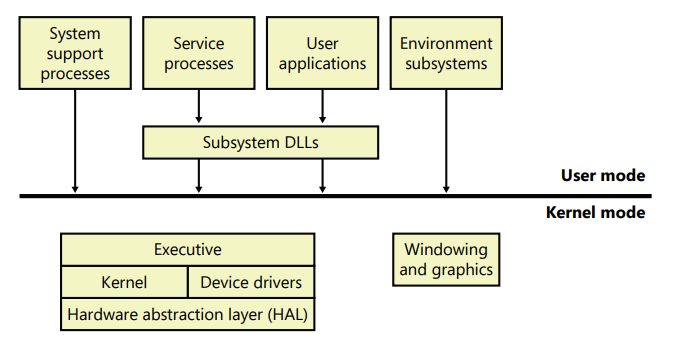

# Windows Internals

Windows internals refers to **the inner workings of the Microsoft Windows operating system, including its core components, how they function, and their architecture.**

To understand how Windows works one needs to know how it **runs processes, manages memory, handles I/O, and secures itself**.

A clear Roadmap to learn everything necessary for Windows Internals:

1.  System Architecture

The overall architecture of the system the key components, how they interact with each other, and the context in which they run.

Look into:

- User mode vs Kernel mode
- Subsystems (Win32, POSIX, etc.)
- System calls and how they cross from user → kernel
- What `ntoskrnl.exe` and `smss.exe` do

1. **Processes, Threads, and Jobs**

The data structures and algorithms that deal with processes, threads, and
jobs in the Microsoft Windows operating system.

Learn how Windows runs programs:

- What a *process* really is?
- What *threads* are and how they share resources?
- Context switching
- Process creation (how `CreateProcess()` works internally)
- Job objects and process groups

1. **Memory Management**

By default, the virtual size of a process on 32-bit Windows is 2 GB. If the image is marked specifically as large address space aware, and the system is booted with a special option, a 32-bit process can grow to be 3 GB on 32-bit Windows and to 4 GB on 64-bit Windows. The process virtual address space size on 64-bit Windows is 7,152 GB on IA64 systems and 8,192 GB on x64 systems.

Look into:

- Virtual memory (and how paging works)
- Page tables, working sets, and page faults
- Physical vs virtual addresses
- The role of the Memory Manager (Mm)
- How the kernel allocates and frees memory

1. Handles, Objects, and the Object Manager

Windows treats almost everything (files, registry keys, processes, etc.) as *objects*.

Look into:

- How object handles work
- Reference counts
- Security descriptors and access control

1. I/O System

The design goals for the Windows I/O system are to provide an abstraction of devices, both hardware
(physical) and software (virtual or logical)

Look into:

- The I/O Request Packet (IRP) model
- Device drivers and the I/O stack
- Plug and Play (PnP)
- Windows Driver Model (WDM)

1. The File System

A file system is **the method used by an operating system to organize, store, and manage files on a storage device like a hard drive or SSD**. It acts as a catalog for the data, defining how files are structured, named, and accessed, ensuring that data can be found and retrieved efficiently. Without a file system, a computer would not be able to locate or organize data, seeing it only as a large, unorganized block of data.  

Look into:

- NTFS internals (MFT, attributes, journaling)
- Caching, file handles, and file mapping
- Symbolic links and reparse points

1. Security

Preventing unauthorized access to sensitive data is essential in any environment in which multiple users have access to the same physical or network resources. An operating system, as well as individual users, must be able to protect files, memory, and configuration settings from unwanted viewing and modification

Look into:

- Access tokens, privileges, and SIDs
- Authentication and logon process (Winlogon, LSASS)
- Integrity levels and UAC
- Code signing, Secure Boot

1. Thread Scheduling and CPU

In Windows internals, the CPU allocation for threads is managed by a component of the kernel called the **dispatcher** (or kernel scheduler), using a **preemptive, priority-driven** scheduling algorithm. The scheduler ensures that the highest-priority runnable thread always gets to run on an available CPU core. 

Look into:

- How the Windows scheduler picks which thread runs
- Priorities and quantum
- Processor groups and affinity

1. System Startup and Boot

The Windows boot process is a series of steps that start with the hardware's firmware ([BIOS/UEFI](https://www.google.com/search?q=BIOS%2FUEFI&sca_esv=2859c3ed548d8d4e&sxsrf=AE3TifNGLVkRML1_MGUl83RZSbDrEw4xBw%3A1762860912980&ei=cB8Tafm7O96XnesP6M_BsQc&ved=2ahUKEwj48rHXgOqQAxXZVmwGHSS9HBAQgK4QegQIARAE&uact=5&oq=System+Startup+and+Boot+in+windows+internals&gs_lp=Egxnd3Mtd2l6LXNlcnAiLFN5c3RlbSBTdGFydHVwIGFuZCBCb290IGluIHdpbmRvd3MgaW50ZXJuYWxzMgUQIRigATIFECEYoAEyBRAhGKABSOsoUC5YvCdwAXgBkAEAmAGnAqABuRmqAQUwLjYuObgBA8gBAPgBAZgCDqAC_xXCAgoQABiwAxjWBBhHwgIGEAAYFhgewgILEAAYgAQYhgMYigXCAggQABiABBiiBMICBRAAGO8FwgIFECEYnwWYAwCIBgGQBgiSBwUxLjYuN6AHk0SyBwUwLjYuN7gH-BXCBwUxLjkuNMgHHw&sclient=gws-wiz-serp&zx=1762860919819&no_sw_cr=1&mstk=AUtExfCQo_5pIlU3V2bPuJq-3xgRGVNnZ3t-qD-0E66B4Ijfw-nKqIjfnRPn2GKM5en2ouCpa-7aZ48UqBEgUJ7B-ZnoI35EZ2T7HqYfVhlVuSF-RTfl3j0UPAscGT1bT0aTs27RLlFr-570t4nfSeYZc4DoEdFzkgIbwu01yEONSk-RHPN_4QKCQMPKXUdvfmCaJl7KJdbrEHe_9IO0WaWN5x2HBwX5tMbYJ0-WB8h3TZApRwfGruNw0d6Y8cSvmF_ubD-dLO84-mdLzxRb0JSpegcNM8tbfVkrrCDfqS5I4UA5NQ&csui=3)) running a power-on self-test (POST) and then loading the Windows Boot Manager. The boot manager then loads the Windows operating system loader (winload.exe), which starts the Windows kernel, followed by the [session manager (smss.exe)](https://www.google.com/search?q=session+manager+%28smss.exe%29&sca_esv=2859c3ed548d8d4e&sxsrf=AE3TifNGLVkRML1_MGUl83RZSbDrEw4xBw%3A1762860912980&ei=cB8Tafm7O96XnesP6M_BsQc&ved=2ahUKEwj48rHXgOqQAxXZVmwGHSS9HBAQgK4QegQIARAF&uact=5&oq=System+Startup+and+Boot+in+windows+internals&gs_lp=Egxnd3Mtd2l6LXNlcnAiLFN5c3RlbSBTdGFydHVwIGFuZCBCb290IGluIHdpbmRvd3MgaW50ZXJuYWxzMgUQIRigATIFECEYoAEyBRAhGKABSOsoUC5YvCdwAXgBkAEAmAGnAqABuRmqAQUwLjYuObgBA8gBAPgBAZgCDqAC_xXCAgoQABiwAxjWBBhHwgIGEAAYFhgewgILEAAYgAQYhgMYigXCAggQABiABBiiBMICBRAAGO8FwgIFECEYnwWYAwCIBgGQBgiSBwUxLjYuN6AHk0SyBwUwLjYuN7gH-BXCBwUxLjkuNMgHHw&sclient=gws-wiz-serp&zx=1762860919819&no_sw_cr=1&mstk=AUtExfCQo_5pIlU3V2bPuJq-3xgRGVNnZ3t-qD-0E66B4Ijfw-nKqIjfnRPn2GKM5en2ouCpa-7aZ48UqBEgUJ7B-ZnoI35EZ2T7HqYfVhlVuSF-RTfl3j0UPAscGT1bT0aTs27RLlFr-570t4nfSeYZc4DoEdFzkgIbwu01yEONSk-RHPN_4QKCQMPKXUdvfmCaJl7KJdbrEHe_9IO0WaWN5x2HBwX5tMbYJ0-WB8h3TZApRwfGruNw0d6Y8cSvmF_ubD-dLO84-mdLzxRb0JSpegcNM8tbfVkrrCDfqS5I4UA5NQ&csui=3) and user login. 

Look into:

- From BIOS/UEFI → Boot Manager → Kernel → Logon
- Roles of `bootmgr`, `winload.exe`, and `smss.exe`
- Session creation

1. Debugging and Tools

Debugging in Windows internals is **the process of finding and fixing bugs in the operating system or its components**, while the tools include the [**Debugging Tools for Windows**](https://www.google.com/search?q=Debugging+Tools+for+Windows&sca_esv=2859c3ed548d8d4e&sxsrf=AE3TifO6EiDXVIRQnHP8lS_A90JHNxN4Sw%3A1762861194395&ei=iiATafv6F4G9seMPyeCE6Ao&ved=2ahUKEwj-sJLVguqQAxVMRmcHHQVeB-QQgK4QegQIARAC&uact=5&oq=what+is+Debugging+and+Tools+in+windows+inetrnals&gs_lp=Egxnd3Mtd2l6LXNlcnAiMHdoYXQgaXMgRGVidWdnaW5nIGFuZCBUb29scyBpbiB3aW5kb3dzIGluZXRybmFsc0gAUABYAHAAeAGQAQCYAQCgAQCqAQC4AQPIAQD4AQGYAgCgAgCYAwDiAwUSATEgQJIHAKAHALIHALgHAMIHAMgHAA&sclient=gws-wiz-serp&mstk=AUtExfCrEFJzIuE49IJCQCXGFZdWFqsN_NpjgqYNn6VAymhs07C5pExY7yWqZZ25nhqm-GFWiRJlaJnWQ-dpDYGedyAEoSDFx0ut82IpP5Z0LwnKkv7V3qXaILmtdYgUV-JIHLGI7g10_PNuqvtbiC2zegcBEYFBOWH6uVWTPTqvh0Hn9al8Kee5gZMs2YPMVg9QPAhPFRZniqagw1hZwEA4TaZPOtHzft3AwSF1RGcTZ_o6Jtg7U0fQPkkFQmgWFL59po6q_4EKMDRD7jWYrNUD_0HHBwPh8RYQghpSHyAN5IG0jw&csui=3) package, which provides powerful utilities like the WinDbg GUI and command-line debuggers (CDB, NTSD, KD) for analyzing system behavior. These tools allow developers and system administrators to set breakpoints, step through code, and inspect system states in both user-mode and kernel-mode to diagnose crashes and performance issues. 

Look into:

- Sysinternals tools (`Process Explorer`, `Procmon`, `Autoruns`, etc.)
- WinDbg basics (stack traces, symbols)
- PerfMon, Event Viewer
